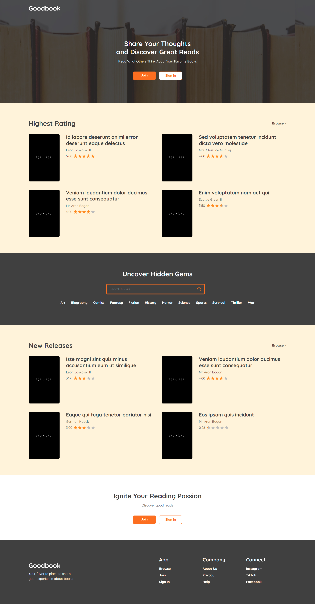
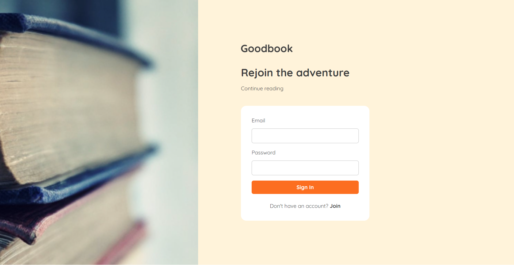
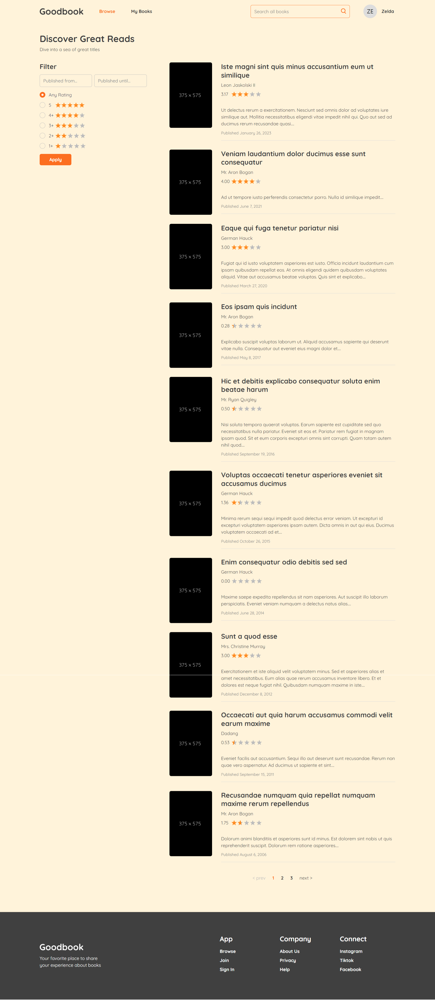
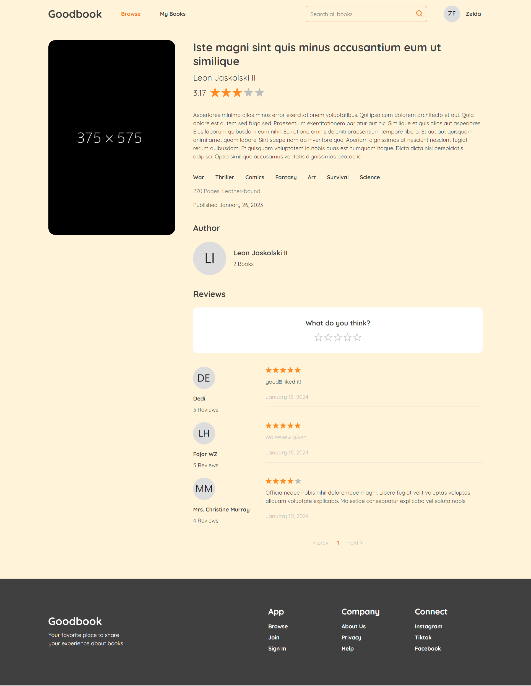
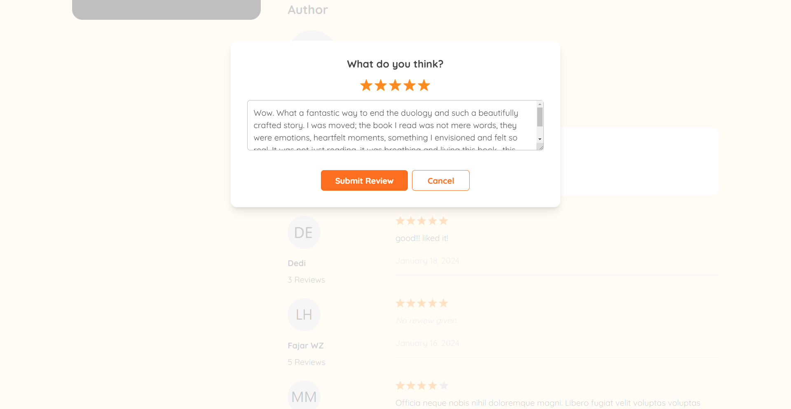
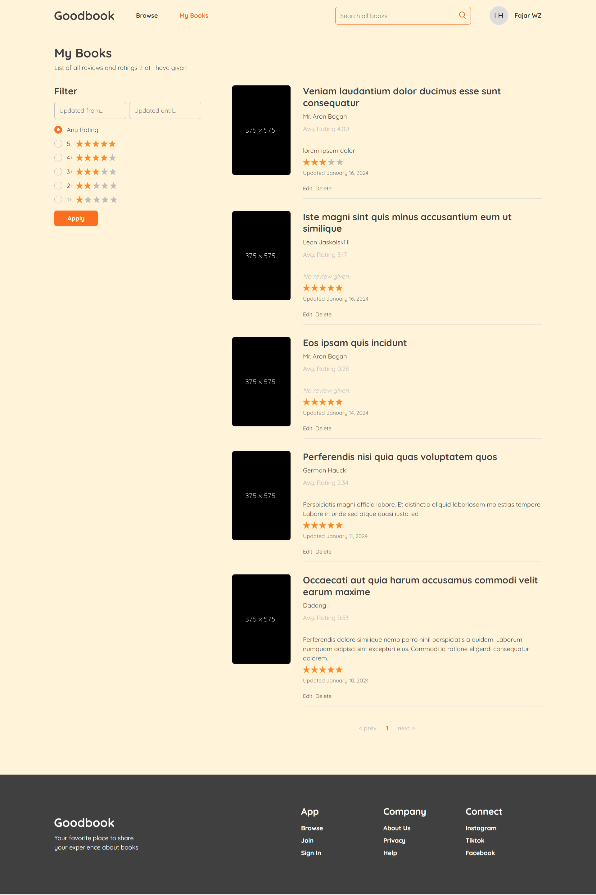
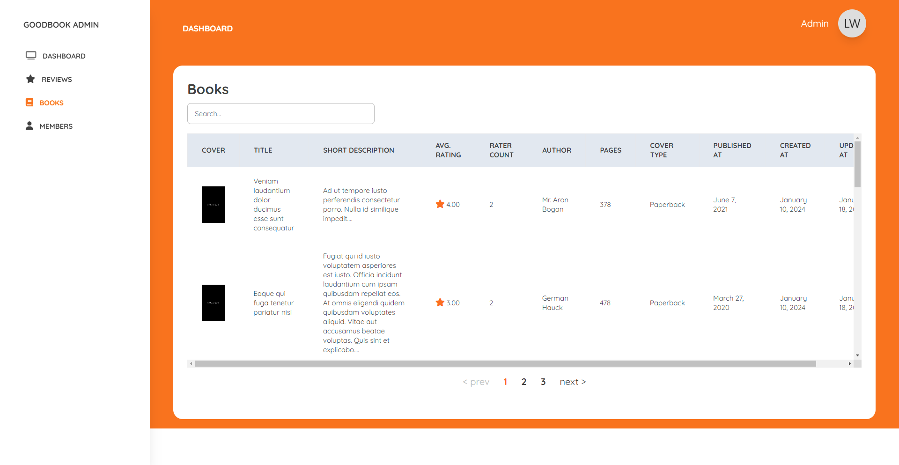

# Goodbook

Goodbook is a place for bookworms where they can dissect plot twists, analyze character arcs, and share their unique reading experiences. Find your next great read, discover hidden gems, and join a community that celebrates the magic of books. Let's turn "what did you think?" into a vibrant conversation. 

Built with Laravel and React. Laravel repo can be found here [goodbook-be](https://github.com/fajarwz/goodbook-be).

## Features
- Landing page
- Join and sign in by email
- Browse books with published at and rating filters
- Search all books
- Show a book
- Review a book
- List of user reviewed books with updated at and rating filters
- Login as admin
- Admin review list
- Admin book list
- Admin member list

## Technologies
This project is built using the following technologies:

- Backend: Laravel
- Frontend: React
- Authentication: Laravel Sanctum
- Database: MySQL
- Server State Management: React/TanStack Query
- HTTP client: Axios

## Installation

### Frontend

#### Set Up .env

Create `.env` file from `.env.example` and adjust it with your development environment.

### Install Dependencies

```bash
npm install
```

### Run the Development Server

```bash
npm run dev
```

Open [http://localhost:5173](http://localhost:5173) with your browser to see the result.

## Screenshots

### Home Page


### Join Page


### Sign In Page


### Browse Books Page


### Book Detail Page


### Review A Book


### My Books Page


### Admin Book List Page


## Demo

[](https://www.youtube.com/watch?v=YkXaAFoAEvg)
